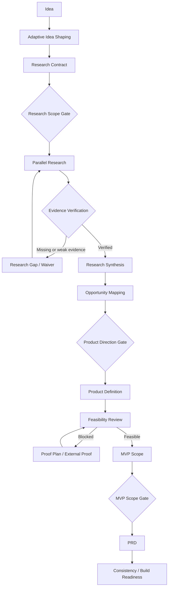
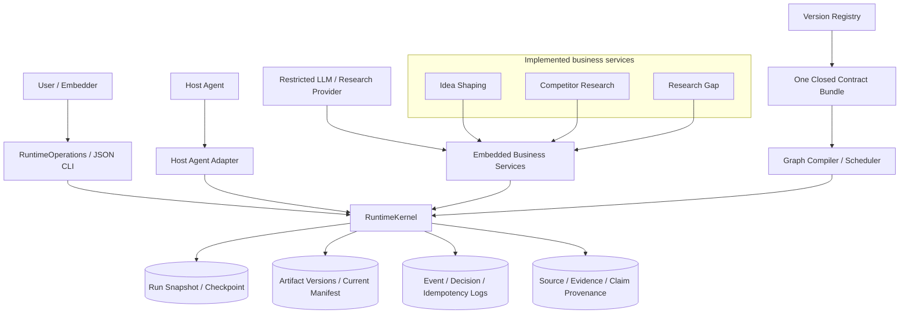

# IdeaToProduct

> A contract-driven Product Discovery Agent Harness and SkillGraph Runtime.

IdeaToProduct 面向正在构建长时运行 Product Discovery Agent 的开发者与工程团队。它尝试解决一个具体问题：如何把模糊产品想法逐步转化为可追溯的研究、证据、产品决策、MVP 定义与 PRD，同时让长流程可以验证、暂停、恢复和审计。

项目将 Host Agent / LLM 的语义判断与确定性 Runtime 分离：模型和受限 Provider 提出问题、假设或事实候选，Runtime 掌握 Contract 解析、调度、状态、权限、预算、持久化、证据闭包与人工 Gate。当前仓库已经提供 Runtime Foundation、Idea Shaping、部分竞品研究和 Research Gap 能力，但尚未完成从 Idea 到最终 PRD 的端到端业务闭环。

## Overview

IdeaToProduct 不是单一 Prompt、固定脚本集合，也不是把几个 Agent 顺序调用起来的演示。它更接近一个面向产品发现流程的 Agent Harness：

- 使用版本化、闭合的 Contract Bundle 描述 Workflow、Skill、Profile、Schema、Subgraph、Template 与 Fixture；
- 使用确定性 SkillGraph Runtime 编译依赖、调度 Attempt、验证 Executor 输入输出并推进状态；
- 使用 Checkpoint、Artifact、Current Manifest 和 append-only Log 保存长流程状态；
- 使用 Source → Evidence → Claim Provenance 约束外部事实；
- 将 Interactive Input、Human Gate 与 External Proof 作为三种不同的等待和恢复语义；
- 允许 LLM 提供语义智能，但不把状态写入、权限控制或最终聚合交给 LLM 自由决定。

目标流程最终应产生可审计的研究、产品方向、可行性结论、MVP 范围与 PRD。当前实现边界请以 [Current Status](#current-status) 为准。

## Why IdeaToProduct

产品发现很少是一条稳定的线性链路。研究会暴露信息缺口，证据可能过期或互相冲突，用户需要在关键节点做选择，外部证明可能要等待数天，失败后的重试又不能覆盖历史。

普通 Prompt 或松散的多 Agent 编排通常难以同时保证：

- 长流程可以从明确的 Checkpoint 恢复；
- 重试、并发、预算和状态转换保持确定性；
- 同一事实能够回溯到 Claim、Evidence 和 Source；
- 人工决策与模型生成内容不会混为一谈；
- 重放请求不会重复写入，陈旧客户端不会覆盖新状态；
- 已实现能力、静态 Contract 和未来设计不会被包装成同一件事。

IdeaToProduct 的核心边界是：**LLM 提议语义，Runtime 约束执行。**

## How It Works

当前 <code>0.3.0</code> Workflow Contract 描述的目标流程如下。图中的节点存在于版本化 Workflow，并不表示每个节点都已经拥有可执行的 Python 业务实现。



### 当前可执行范围

- <code>AdaptiveIdeaShapingService</code> 已实现 Idea 的清晰度判断、Completion-first 提问、信息缺口选择、八轮收束、Checkpoint、<code>idea_definition</code> 与 <code>research_contract</code> 生成，并在 Research Scope Gate 批准前阻断 Research。
- <code>CompetitorResearchService</code> 已实现 Candidate Discovery、确定性 Ranking、按竞品 fan-out 的 Deep Dive、Dataset Normalization，以及 Feature、Traction、Review、Pricing 四类 Analysis。
- <code>ResearchGapPlanner</code> 已实现受限 Gap 提议、目标分支验证、精确下游失效、循环上限和返回 <code>research_verifier</code> 的调度逻辑。
- Source Index 与 Source → Evidence → Claim Provenance 由 Kernel 校验并按状态版本持久化。事实候选来自 Fixture 或 Callback Provider；这些 Provider 自身不访问网络、不写 Runtime 状态。
- users、market、technology 的完整真实研究执行，以及 Research Verifier、Evidence Waiver、Synthesis、Direction、Feasibility、MVP、PRD 和 Readiness 尚未形成可运行的端到端链路。

## Architecture



### Host Agent、Provider 与 Adapter

Host Agent 或受限 Provider 负责语言理解和语义候选，例如 Working Hypothesis、下一条澄清问题、Source/Candidate/Deep Dive 内容或 Research Gap 建议。它们不能决定 Runtime State、Artifact Header、Method、权限、预算、Gate 结果或持久化位置。

<code>FixtureAdapter</code>、<code>ManualAdapter</code> 和 <code>HostAgentAdapter</code> 只负责执行或转交 Attempt。任何结果在产生状态影响前，都必须重新经过 Runtime 的身份、Schema、权限、路径、预算和 Output Contract 校验。

### SkillGraph 与 Runtime

Planner 不是一个拥有独立写权限的自由 Agent。规划语义由版本化 Workflow、Skill Contract、依赖、Condition、Subgraph、fan-out/fan-in、Retry Policy 与 Research Gap 共同表达。

Runtime 负责：

- 从 Registry 解析一个完整且唯一的 Contract Bundle；
- 编译 Effective Graph 并执行确定性 DAG 调度；
- 生成 Attempt Plan 与 Input Fingerprint；
- 校验 Executor Request / Result；
- 执行状态转换、预算累计、幂等、CAS 和下游失效；
- 通过 Kernel 单写者提交 Snapshot、Artifact、Manifest 和 Log；
- 在恢复时核对持久化状态与 Current Manifest。

### LLM intelligence 与 deterministic runtime 的边界

| 责任 | LLM / Provider | Runtime / Kernel |
|---|---:|---:|
| 解释模糊 Idea、提出语言候选 | ✓ | 约束输入输出 |
| 提议事实、研究缺口或问题文案 | ✓ | 校验范围与引用 |
| 选择 Contract Bundle |  | ✓ |
| 调度、状态转换、重试和并发配额 |  | ✓ |
| 权限、预算、路径和 Schema 校验 |  | ✓ |
| Artifact、Manifest、Event、Decision 写入 |  | ✓ |
| Human Gate 决策 | 用户 | 记录并执行已提交决策 |
| 最终确定性聚合 | 仅可提供受限判断 | ✓（设计目标，评分链尚未实现） |

## Execution Model

Runtime 将声明式 SkillGraph 编译为不可变的 <code>RunSnapshot</code>，再根据依赖、条件、Profile、终止事件和全局配额计算 <code>ExecutionPlan</code>。Executor 或 Adapter 只能返回提案；Kernel 负责验证并提交结果。

```text
Observe current Snapshot
        ↓
Compile / resolve effective graph
        ↓
Plan ready Attempts and input refs
        ↓
Execute through an explicit Adapter or embedded service
        ↓
Validate proposal, provenance, permissions and budget
        ↓
Commit next Snapshot + Artifact/Manifest/Log
        ↓
Replan, wait, invalidate, retry or finish
```

Dynamic Planning / Replanning 不依赖模型任意改写 DAG：变化必须通过已有 Condition、fan-out、Research Gap、Gate、External Input 或 Runtime Invalidation 进入状态机。

## Core Capabilities

### Current Capabilities

- **Version-aware Contract resolution**：新 Run 默认解析完整 <code>0.3.0</code> Bundle；v0.2 只允许已有 Run 精确 resume/audit；根目录 v0.1 只允许审计。
- **Deterministic orchestration**：支持 DAG、Condition、Subgraph、层级 Node Address、动态 fan-out/fan-in、终止事件和全局并发配额。
- **Contract-driven execution**：校验 Executor Wire、Skill/Profile/Schema 引用、Output Contract、Artifact producer、路径与预算。
- **State and persistence**：支持不可变 Snapshot，以及显式 <code>storage_root</code> 下的单 Writer Run 持久化。
- **Checkpoint and resume**：Interactive Input 在同一 Attempt 上恢复；Human Gate 和 External Proof 使用独立状态路径。
- **Append-only history**：保存 Artifact Version、Checkpoint、Snapshot、Event、Decision 和 Idempotency Log。
- **Concurrency safety**：mutation 使用 expected state version、CAS 和 idempotency key，冲突时 Fail Closed。
- **Precise invalidation**：变更只失效传递下游，保留历史并从未受影响的 Verified 节点恢复。
- **Adapter boundary**：提供 Fixture、Manual 和 Host Agent Adapter，Adapter 不持有 Runtime 写权限。
- **Adaptive Idea Shaping**：生成可恢复的 Idea Definition、Research Contract 和 Research Scope Gate。
- **Constrained competitor research**：生成候选、排名、Deep Dive、Dataset、四类 Analysis 与私有 Provenance。
- **Research Gap planning**：受限地选择重试分支、复用 Artifact、失效下游并返回验证节点。
- **Fact projection prototype**：Fact Binding 与 typed <code>report_projection</code> materialization 已在隔离、未注册的 v0.3.1 测试 Registry 中验证；它不是当前 v0.3.0 Run 的可用能力。

### Designed / Contracted Capabilities

<code>contracts/0.3.1/</code> 与 <code>contracts/0.3.2/</code> 是完整、静态闭合但未注册的 Contract Bundle。它们用于验证下一阶段的 Schema、Skill、Profile、Rubric、Subgraph、Template 和 Fixture，不可用于创建、恢复或审计真实 Run。

这些 staged Bundle 已描述：

- Reference-first Fact-Level Citation；
- typed Report Projection 与 Report Publication Projection；
- Runtime 单写者控制的不可变离线 HTML Report Bundle；
- Native SVG-first Chart Contract 与可选 PNG <code>PARTIAL</code> 兼容输出；
- Profile-specific、版本化的五维等权 Rubric；
- 独立 Score Verification 与 Runtime-owned deterministic aggregation；
- Report successor 的 section ownership、CAS 与 append-only publication。

**静态 Contract 存在不等于 Renderer、Publisher、Scoring、Verifier 或真实 Run 集成已经实现。**

## Runtime State, Checkpoint and Resume

```text
Registry + requested operation/version
                    ↓
       one closed Bundle Context
                    ↓
    Compiled SkillGraph + Run Policy
                    ↓
 Scheduling / Executor proposal validation
                    ↓
          RuntimeKernel commit
                    ↓
Snapshot + Manifest + Artifact + Event/Decision/Idempotency Logs
```

- 未配置 <code>storage_root</code> 时，纯内存的 <code>create_run</code>、<code>schedule</code> 和 Executor Proposal 校验仍可使用；持久化入口会明确返回 <code>storage_root_required</code>。
- 持久化 Run 位于 <code>&lt;storage_root&gt;/runs/&lt;run_id&gt;/</code>，一个 Run 只允许一个 Orchestrator Writer。
- 已持久化 Run 总是使用 Snapshot 中记录的 Contract Version 恢复，不迁移到默认版本，也不跨 Bundle 搜索或拼装缺失文件。
- Interaction Resume 不增加新的 Attempt；Gate Decision 必须经过对应 Decision Schema 校验并关联 Event Offset。
- Current Manifest 绑定已提交 Event 前缀。Recovery 会报告未被 Current Manifest 选中的 Snapshot/Artifact 文件和未提交 Event 尾部，但不会删除它们，也不会把它们判定为可安全 GC。
- Retention / GC 尚未实现。

## Evidence and Verification

外部事实的基本追踪模型是：

```text
Rendered or analyzed fact
          ↓
        Claim
          ↓
       Evidence
          ↓
        Source
```

- Provider 只能返回不受信任的 Source、Candidate 或 Deep Dive 候选；Kernel 会重新构造 Header、校验 Schema、规范化 Source Identity，并检查 Evidence/Claim 引用闭包。
- Source URL canonicalization 只在本地处理无凭据的 HTTP(S) URL，不发起网络请求。
- 相同 Source Identity 的非易变字段发生冲突时会被拒绝，别名 Source ID 会在写入业务 Artifact 前重写为稳定 ID。
- HTML、SVG、外部 URL 或自由文本都不能自行成为事实来源，也不能被 Report Builder 用来猜测 Citation。
- 当前 Provenance 能力不等于完整 Research Verification；独立 Research Verifier、Score Verifier 与最终 Report Verification 仍未形成当前版本的业务闭环。

## Project Structure

```text
IdeaToProduct/
├─ contracts/
│  ├─ registry.yaml          # registered lifecycle and compatibility policy
│  ├─ 0.2.0/                # frozen_previous; existing Run resume/audit
│  ├─ 0.3.0/                # current; default for new Runs
│  ├─ 0.3.1/                # staged static Bundle; unregistered
│  └─ 0.3.2/                # staged static Bundle; unregistered
├─ src/skillgraph_runtime/   # Runtime, storage and implemented business services
├─ tests/                    # contract, runtime, recovery and business tests
├─ scripts/                  # static Contract validation and compatibility facade
├─ README.md
├─ PRD_v*.md / SPEC_v*.md
├─ REQUIREMENTS.md
├─ IMPLEMENTATION_PLAN.md
└─ progress.md
```

根目录的 <code>workflow.yaml</code>、<code>profiles/</code>、<code>schemas/</code>、<code>skills/</code>、<code>subgraphs/</code>、<code>templates/</code> 和 <code>fixtures/contracts/</code> 共同构成不可变的 <code>0.1.0</code> 审计基线。它们不是当前新 Run 的配置入口。

<code>.venv/</code>、<code>build/</code>、<code>.pytest_cache/</code> 和 <code>*.egg-info/</code> 是本地环境或生成物，不属于架构入口。

## Quick Start

### Requirements

- Python 3.11+
- pip
- 不需要 <code>.env</code>；当前实现不直接访问网络服务，也不要求 API Key。

以下命令已按 Windows PowerShell 路径验证：

```powershell
python -m venv .venv
.\.venv\Scripts\python.exe -m pip install -r requirements-dev.txt

$created = .\.venv\Scripts\python.exe -m skillgraph_runtime.cli --repository-root . --storage-root .\run-data init --idea "Build an evidence-driven product discovery assistant" --profile developer_tool --idempotency-key demo-create-001 | ConvertFrom-Json
$runId = $created.data.run_id

.\.venv\Scripts\python.exe -m skillgraph_runtime.cli --repository-root . --storage-root .\run-data status --run-id $runId
```

<code>requirements-dev.txt</code> 当前包含 editable package install（<code>-e .</code>）和固定版本的 pytest，因此该安装步骤会同时安装项目及开发测试依赖。使用 <code>python -m skillgraph_runtime.cli</code> 可以避免依赖特定平台的 console-script shim。

<code>init</code> 会创建一个持久化的 <code>0.3.0</code> Run。CLI 的 <code>run</code> 命令只调度 Ready Attempt，不会自动执行所有嵌入式业务服务，也不会发起联网研究。项目目前没有稳定的一键 Idea → PRD 演示；<code>export_prd</code> 仍会以 <code>operation_not_implemented</code> 明确拒绝，而不是返回伪造结果。

### Public runtime entry points

- <code>RuntimeKernel</code>：纯内存调度/状态核心与持久化 Kernel API；
- <code>RuntimeOperations.dispatch(operation, envelope)</code>：CLI 与 Embedder 共享的稳定 Operation Boundary；
- <code>skillgraph_runtime.cli</code>：输出单一 JSON Envelope 的命令行入口；
- <code>FixtureAdapter</code>、<code>ManualAdapter</code>、<code>HostAgentAdapter</code>：显式 Executor Adapter；
- <code>AdaptiveIdeaShapingService</code>、<code>CompetitorResearchService</code>、<code>ResearchGapPlanner</code>：当前已实现的嵌入式业务服务。

## Version Model

仓库同时存在三个不同的版本维度：

| Version surface | Current value | Meaning |
|---|---|---|
| Python package | <code>0.2.0</code> | <code>product-discovery-skillgraph-runtime</code> 包版本 |
| Runtime API envelope | <code>0.2.0</code> | <code>RuntimeOperations</code> / CLI Wire 版本 |
| Default Contract / Workflow | <code>0.3.0</code> | Registry 为新 Run 选择的闭合 Bundle |

它们目前并不相同，分别服务于包发布、API Wire 与 Contract Lifecycle。不要把 package/API version 当作当前 Workflow version，也不要把未注册的 <code>0.3.1</code> 或 <code>0.3.2</code> 传给真实 Run。

Registry 当前生命周期：

| Contract | Status | New Run | Resume | Audit |
|---|---|---:|---:|---:|
| <code>0.1.0</code> | <code>immutable_baseline</code> | No | No | Yes |
| <code>0.2.0</code> | <code>frozen_previous</code> | No | Yes | Yes |
| <code>0.3.0</code> | <code>current</code> | Yes | Yes | Yes |
| <code>0.3.1</code> / <code>0.3.2</code> | staged, unregistered | No | No | No |

## Current Status

| Capability | Status |
|---|---|
| v0.3.0 Registry、Bundle 与 Runtime Foundation | **Implemented** |
| Persisted Run、Checkpoint、Resume、CAS、Idempotency、Invalidation | **Implemented** |
| Adaptive Idea Shaping 与 Research Scope Gate | **Implemented** |
| Competitor Research 到 Dataset / Analysis | **Implemented with fixture/callback providers** |
| Research Gap Planner | **Implemented** |
| v0.3.1 / v0.3.2 Contract closure | **Designed and statically validated** |
| Current-version Chart Renderer / Chart Bundle pipeline | **Not implemented in the current <code>src</code> tree** |
| Immutable HTML Report Publisher | **Not implemented in the current <code>src</code> tree** |
| Transparent Scoring / independent Score Verifier | **Designed, not implemented** |
| Full Research → Decision → MVP → PRD workflow | **Not implemented** |
| HTTP service、database、queue、multi-writer、UI | **Not provided** |

此外，仓库当前没有 <code>LICENSE</code> 文件。代码公开可见不等于已经授予某个开源许可证；在许可证明确前，请不要假定具有特定的复制、修改或分发授权。

## Roadmap

Roadmap 按当前依赖关系排序，不代表已承诺的发布日期：

1. 将受控 Chart Renderer、<code>chart_bundle_collection</code> 和安全 SVG Asset 写入接入真实 Run，并定义可选 PNG 的 <code>COMPLETE</code> / <code>PARTIAL</code> 行为。
2. 完成 Publication Projection 与不可变离线 HTML Report Builder / Publisher，保留 Citation Closure、CAS 和 append-only publication。
3. 完成 Research Verification、Evidence Waiver、Synthesis 和完整 Research Gap 闭环。
4. 完成 Product Direction、Feasibility、External Proof、MVP、PRD 与 Build Readiness 业务链。
5. 在真实集成通过后再评估 staged Bundle 的 Registry promotion、端到端 Evaluation、UI 和外部 Observability。

## Documentation

### Current documentation

- [PRD v0.3](PRD_v0.3.md) / [SPEC v0.3](SPEC_v0.3.md)：当前注册 <code>0.3.0</code> Contract 的 Report/Chart Artifact Amendment 与版本生命周期。
- [PRD v0.2](PRD_v0.2.md) / [SPEC v0.2](SPEC_v0.2.md)：v0.3 在 Amendment 范围外继承的冻结产品与系统基线。
- [PRD v0.3.1](PRD_v0.3.1.md) / [SPEC v0.3.1](SPEC_v0.3.1.md)：已批准但未激活的下一阶段设计。
- [Requirements](REQUIREMENTS.md)：当前与历史授权范围、验收标准和明确排除项。
- [Implementation Plan](IMPLEMENTATION_PLAN.md)：实施顺序、依赖与验证计划。
- [Progress](progress.md)：任务状态与历史验证记录；实现声明仍需以当前代码和可重复验证为准。
- [API Contract](API_CONTRACT.md)：进程内 Operation、CLI、Wire、错误和兼容边界。
- [Backend Structure](BACKEND_STRUCTURE.md)：模块、数据流、安全与可观测性边界。
- [Tech Stack](TECH_STACK.md)：语言、依赖、存储和工具链。

### Historical / archived documentation

- [PRD v0.1](PRD_v0.1.md) / [SPEC v0.1](SPEC_v0.1.md)：初始冻结基线。
- [PRD Consolidation Report](PRD_CONSOLIDATION_REPORT.md) / [SPEC Consolidation Report](SPEC_CONSOLIDATION_REPORT.md)：v0.2 合并过程。
- [PRD Changelog](PRD_CHANGELOG.md) / [SPEC Changelog](SPEC_CHANGELOG.md)：Requirement / Decision 演进记录。
- [v0.2 Change Impact](V0.2_CHANGE_IMPACT.md)、[v0.3 Change Impact](V0.3_CHANGE_IMPACT.md)、[v0.3.1 Change Impact](V0.3.1_CHANGE_IMPACT.md)：各版本变更影响。

## Development and Validation

```powershell
.\.venv\Scripts\python.exe scripts\validate_contracts.py
.\.venv\Scripts\python.exe -m pytest -q
.\.venv\Scripts\python.exe -m pip check
.\.venv\Scripts\python.exe -m pip wheel . --no-deps --wheel-dir .pytest_cache\wheels
```

验证范围：

- 静态验证器分别检查 Registry、不可变 v0.1、冻结 v0.2、当前 v0.3，以及 staged v0.3.1 / v0.3.2；不同 Bundle 之间不会搜索或补齐缺失文件。
- pytest 覆盖 Schema/Contract、版本解析、Graph/Scheduler、Executor 校验、Runtime Persistence、Recovery、Operations/CLI、Idea Shaping、Competitor Research、Provenance 和 Research Gap。
- <code>pip check</code> 检查已安装依赖一致性；无依赖 wheel 构建会同时验证 package metadata 能读取本 README。

静态验证器成功返回 <code>0</code>，Contract 或 Schema 错误返回 <code>2</code>，未分类内部错误返回 <code>10</code>。

## Explicit Non-Goals Today

为避免把设计目标误读为现有产品能力，当前仓库明确不提供：

- 自动联网的 Deep Research 服务或 Vendor-specific Research Adapter；
- 可直接部署的 HTTP API、Web Server、数据库、队列或多 Writer 协调；
- 已接入当前 Run 的 Native Chart Renderer、PNG Exporter 或 HTML Report Publisher；
- 自由形式的 LLM 总评分器；
- 完整的产品方向、可行性、MVP、PRD 与 Readiness 自动化执行；
- 生产部署、迁移、发布流程或 UI。

这些边界不是对最终架构目标的否定，而是对当前 <code>main</code> / <code>HEAD</code> 可验证事实的说明。
